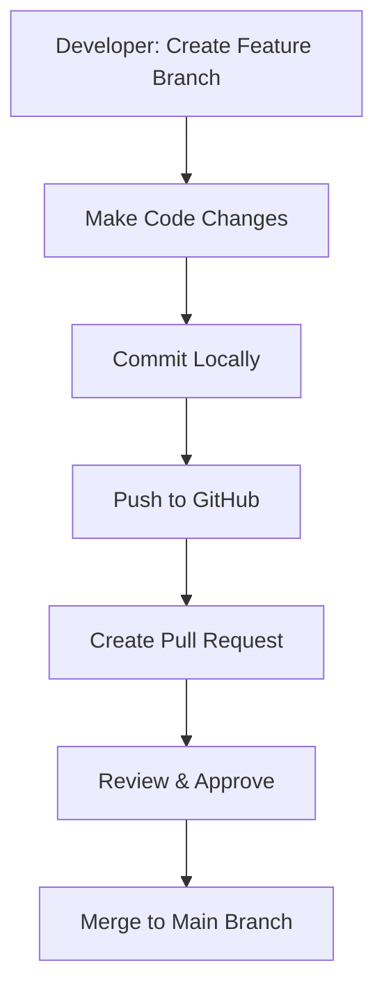

## Day 1: Git & GitHub Concepts for DevOps

### 📌 Why Git and GitHub?

Git is a distributed version control system used to manage source code changes. GitHub is a remote hosting service for Git repositories.

> **Use case (real-world DevOps):** In a microservices-based project, multiple developers work on different services. Git helps version code independently and GitHub enables centralized collaboration and integration (CI/CD).

---

### 🔍 Topics Covered:

1. **What is Git?**

   * Version control system
   * Tracks code changes
   * Enables collaboration

2. **Git vs GitHub**

   | Feature         | Git             | GitHub                                    |
   | --------------- | --------------- | ----------------------------------------- |
   | Local or Remote | Local           | Remote (cloud-based)                      |
   | Purpose         | Version control | Repository hosting and team collaboration |

3. **Git Installation & Configuration**

   ```bash
   git config --global user.name "Your Name"
   git config --global user.email "you@example.com"
   ```

4. **Git Commands**

   ```bash
   git init                   # Initialize local repo
   git status                # Show file status
   git add .                 # Stage all files
   git commit -m "message"  # Commit changes
   git log                   # Show commit history
   ```

5. **Branching**

   * `git branch feature-x` → Create branch
   * `git checkout feature-x` → Switch branch
   * `git merge feature-x` → Merge to main

6. **Remote Repos**

   * `git remote add origin <URL>` → Link remote repo
   * `git push -u origin main` → Push local changes to GitHub

7. **Cloning & Pulling**

   * `git clone <repo-url>`
   * `git pull origin main`

8. **.gitignore**

   * Ignore node\_modules, .env files etc.

---

### ✅ Advantages of Git & GitHub

* Tracks complete history
* Parallel development with branches
* Collaboration through pull requests
* Open source and supported by all CI/CD tools

### ⚠️ Disadvantages / Challenges

* Merge conflicts
* Steep learning curve for branching & rebasing
* Misuse of main branch (direct commits)

---

### 🔄 Git Workflow Diagram

```
Local Dev → Commit → Push → GitHub Repo → PR → Review → Merge to Main
```



---

### 💭 Common Questions

* What is the difference between `git fetch` and `git pull`?

  * `git fetch` gets changes from remote but doesn’t merge.
  * `git pull` gets changes and merges them.

* Can I commit directly to main?

  * Technically yes, but not recommended in production. Always use feature branches.

* What is the purpose of `.gitignore`?

  * To prevent sensitive/unwanted files from being committed (e.g., credentials, cache).

* What is the difference between `git clone` and `git remote`?

  * `clone` copies repo from remote to local. `remote` manages GitHub link of an existing local repo.

---

### 💡 Tips

* Always name your branches clearly: `feature/signup`, `bugfix/login-404`
* Commit messages should be short but meaningful.
* Use `git status` and `git log` frequently.
* Use `.gitignore` wisely.
* Avoid force push (`git push -f`) unless absolutely needed.

---

### 🧠 DevOps Principles Related to Git & GitHub

1. **Infrastructure as Code (IaC)** → Git stores all infra definitions.
2. **Continuous Integration** → GitHub triggers CI pipelines after every commit or PR.
3. **Collaboration** → Branching and PRs help teams work independently.
4. **Versioning** → Every release, config or code is versioned using Git.
5. **Automation** → GitHub Actions or external CI/CD tools use Git triggers.

---

### 📘 Learning Outcomes (Day 1)

* You now understand how Git and GitHub work
* You can push code using a proper Git flow
* You’re ready to start CI/CD (Day 2!)

---

### 🔚 End of Day 1


